<h3><code>Ibrahim@github ~ $ whoami</code></h3>

<table>
<tr>
<td valign="top"></td>
<td valign="top"></td>
</tr>
</table>

 
 

<h1 align="center">Hi 👋, I'm Ibrahim Naseef</h1>

# 💫 About Me
DevOps Engineer with 2 years of experience at Tata Consultancy Services (TCS), specializing in Azure DevOps, AWS, Jenkins, Terraform, Docker, and Python. I build reliable CI/CD pipelines, automate cloud and infrastructure workflows, and improve release velocity with secure, repeatable delivery.

- Experienced in enterprise DevOps, pipeline governance, and deployment automation
- Skilled in cloud automation, infrastructure as code, and container orchestration
- Currently exploring Agentic AI to build smarter automation and operational tooling

## 🌐 Socials:

# 💻 Tech Stack:

# 📊 GitHub Stats:

  

### ✍️ Random Dev Quote

### 😂 Random Dev Meme

## Total Views
